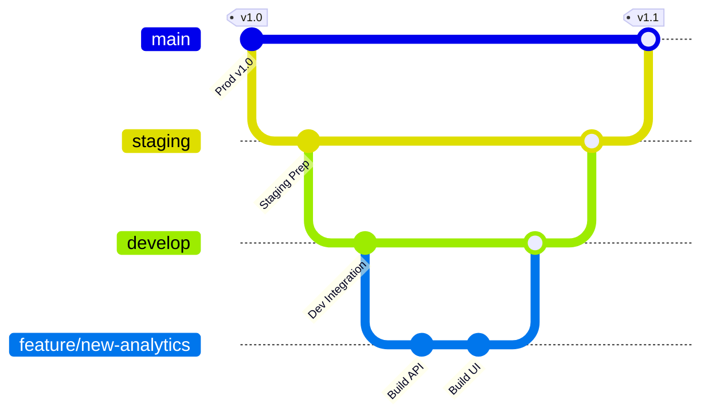

# 🌲 Git Branching Strategy & Release Workflow

This document details the Git branching strategy and release workflow for the **ReviewFlow AI** platform. It ensures safe, decoupled releases, prevents developer conflicts, and aligns branches with our isolated environments (`local`, `staging`, `production`).

---

## 🗺️ Git Branch Architecture

We utilize an **Environment-driven branching model**. Work is *never* done directly on main/master or environment branches. All changes originate in short-lived feature/bugfix branches, progress to local integration, move to staging for QA, and are finally promoted to production.



---

## 🛠️ Environment-to-Branch Mapping

We maintain three primary environment-tracking branches across all repositories:

| Branch Name | Target Environment | Database Used | Purpose |
| :--- | :--- | :--- | :--- |
| **`develop`** | **Local Development** | Local PostgreSQL (`reviewflow`) | Integration branch where developers merge their completed feature branches. |
| **`staging`** | **Staging Environment** | Isolated Staging PostgreSQL | Pre-production validation and QA testing. Matches production infrastructure exactly. |
| **`main`** *(or `master`)* | **Production Environment** | Production PostgreSQL | Secure, highly stable, live deployment. Updated only via release merges from staging. |

---

## 🔄 The 5-Step Developer Workflow

Follow this pipeline for every new feature, improvement, or bugfix:

### 1️⃣ Step 1: Create a Short-lived Work Branch
Always branch off the latest `develop` branch.
```bash
git checkout develop
git pull origin develop
git checkout -b feature/your-feature-name
```

### 2️⃣ Step 2: Develop and Test Locally
Write your code inside the respective service repository (e.g. `frontend`, `admin`, `backend`). Spin up your local compose environment to run live integration tests:
```bash
# Inside onboard folder
./clone-and-build.sh local
```

### 3️⃣ Step 3: Merge into Develop (Integration)
Once local testing is successful, push your branch and open a **Pull Request (PR)** to merge into `develop`.
```bash
git add .
git commit -m "feat: added new analytics charts"
git push origin feature/your-feature-name
```
*After review and approval, merge the PR into `develop`. Run local validation to verify integration.*

### 4️⃣ Step 4: Promote to Staging (Verification)
When features are ready for QA testing, promote `develop` to `staging` by merging:
1. **Merge develop to staging on Git:**
   ```bash
   git checkout staging
   git pull origin staging
   git merge develop
   git push origin staging
   ```
2. **Deploy on your Staging Server:**
   Log into your staging environment and run our multi-repo automators inside the `onboard` folder:
   ```bash
   # Sync staging branch across all microservices
   ./git-pull-all.sh staging
   
   # Re-build and launch staging containers
   ./clone-and-build.sh staging
   ```

### 5️⃣ Step 5: Release to Production (Live Deployment)
Once staging testing passes and is approved, promote the stable `staging` branch to `main`:
1. **Merge staging to main on Git (and Tag the release!):**
   ```bash
   git checkout main
   git pull origin main
   git merge staging
   git tag -a v1.1.0 -m "Release v1.1.0"
   git push origin main --tags
   ```
2. **Deploy on your Production Server:**
   Log into your production server and run the automator script in the `onboard` folder:
   ```bash
   # Sync main branch across all microservices
   ./git-pull-all.sh main
   
   # Re-build and launch production containers securely
   ./clone-and-build.sh production
   ```

---

## 💡 Multi-Repo Best Practices

* **Keep Branches Synchronized:** Try to use the same feature branch name (`feature/xyz`) across repositories if a task spans multiple services (e.g., a backend model change that requires a frontend UI update).
* **Tag Releases:** Always create annotated tags (e.g., `v1.2.0`) on the `main` branch before deploying. This provides a clear rollback point if issues arise in production.
* **Database Schema Changes:** Additive database changes (adding columns/tables) can be pushed smoothly via auto-deployment. If you perform a destructive schema change, always backup production first!
