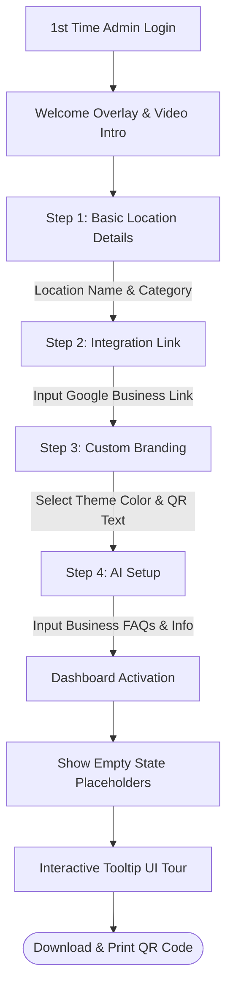
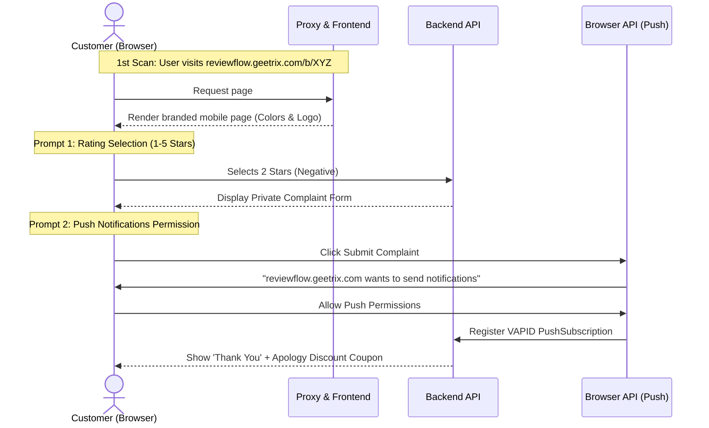

# 🌟 First-Time User Experience (FTUE) & Onboarding Flow Guide

This guide details the onboarding workflow and user experience for first-time visitors of the **ReviewFlow AI** platform. It provides product and development teams with a blueprint of the step-by-step UI actions, empty states, and permission prompts designed to maximize conversion and engagement.

---

## 👔 1. New Business Owner (Admin) Onboarding Wizard

When a business owner logs into `reviewflow.geetrix.com/admin` for the first time, they are welcomed by an interactive onboarding wizard. This step-by-step setup guides them through basic configuration to get their first QR code active in under 2 minutes.

### 📋 Detailed Admin Wizard Experience

| Wizard Step | UI Element | User Actions & Guidance | Behind the Scenes (API / DB) |
| :--- | :--- | :--- | :--- |
| **0. Welcome Overlay** | Fullscreen modal with a sleek glassmorphic style. | Owner reads a 30-second onboarding intro and clicks *"Let's Get Started!"*. | Triggers `isFirstTime` flag update in the user database model. |
| **1. Business Details** | Inputs: Business Name, Business Category, Address. | Owner types their restaurant, clinic, or store details. | Creates a new `Business` record linked to the user's `userId`. |
| **2. Integration Link** | Single, prominent input field with Google fetch helpers. | Owner pastes their Google Maps review link. A preview of their Google rating is shown. | Saves `googleReviewLink` to the `Business` database table. |
| **3. Look & Feel** | Interactive color picker and real-time mobile card preview. | Owner selects a primary brand color and edits the QR subtitle text. | Saves `primaryColor` and `qrCodeText` settings. |
| **4. AI Intelligence** | Textarea: *"Tell the AI about your FAQs, menu, or details."* | Owner types standard FAQs (e.g. *"Open daily till 10 PM. Vegan options available."*). | Saves info into the `knowledgeBase` field in the database. |

#### 🪹 Empty States & Tooltip Tour
Once the owner completes the wizard, they land on their main dashboard. Since they have no scans yet:
* **Empty State Charts:** Charts show mock, blurred lines with a placeholder: *"Your analytics will appear here as soon as customers start scanning your QR code! 📊"*
* **Interactive Guided Tour:** Interactive, animated tooltips appear sequentially to point out:
  1. **Analytics Tab:** Where scans and click-through rates live.
  2. **Private Inbox:** Where negative complaints are safely intercepted.
  3. **VAPID Push Prompts:** A banner asking the admin to *"Enable Browser Push Alerts"* so they get real-time sound/screen alerts when a customer submits a complaint.

---

## 📲 2. New Customer (Reviewer) First-Time Landing Flow

When an end-customer scans the printed QR code for the first time, they land on the mobile-optimized submission page. The experience is designed to be frictionless, requiring no app installation or account signup.

### 📋 Detailed Customer FTUE Steps

#### 🎬 Step 1: Instant Branded Render
* **Customer Action:** Customer scans the QR code at their table or checkout counter.
* **UI/UX Experience:** The page loads in less than 500ms (highly optimized index bundle). The browser header color and page accents automatically adapt to the business's custom primary color. A large friendly logo and welcome greeting are shown: *"Welcome to [Business Name]! 🍕"*.

#### 🔔 Step 2: Push Notification Request (Optional/High Value)
* **Customer Action:** The user fills in the complaint form (for 1-3 star ratings).
* **UI/UX Experience:** A subtle banner appears: *"Want to receive a direct reply from our manager on your phone? Click Allow to stay updated."*
* **Behind the Scenes:** The browser requests notification permissions using the VAPID keys. If the customer clicks **Allow**, a `PushSubscription` is created and linked to the feedback entry. The business owner can then message the customer back, and the customer receives a **push notification banner** directly on their mobile home screen!

#### 🎟️ Step 3: Compensation & Redemption
* **Customer Action:** Customer clicks submit.
* **UI/UX Experience:** The screen transitions with a smooth animation to a thank-you page: *"Thank you for helping us improve!"*. Below, a digital scratch card or coupon code is displayed: *"As an apology, here is 10% off your next visit! Show this code: SORRY10 at checkout."* This instantly turns an unhappy customer into a loyal advocate.
