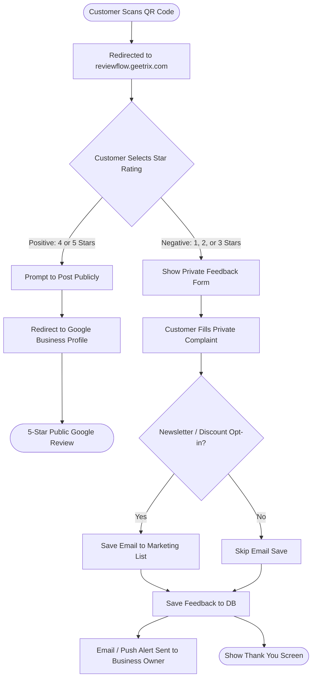
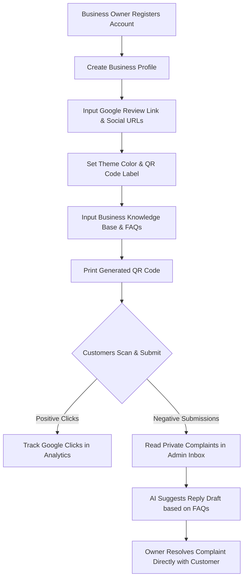

# 📲 ReviewFlow AI: User Experience & Flow Guide

This document explains the end-to-end user journeys and data flows within the **ReviewFlow AI** platform. It acts as a reference for product behavior, detailing how customers submit feedback and how business owners manage their reputation.

---

## 🔁 The Customer Review Submission Flow

This mobile-first sequence handles how a customer interacts with the QR code at a business premises. It utilizes an **insistent feedback loop** to protect the business's public rating by intercepting negative reviews.

---

## 👔 The Business Owner (Admin) Setup Flow

This flowchart maps the onboarding, customization, and management steps for a business owner using the admin panel at `reviewflow.geetrix.com/admin`.

---

## 📖 Deep-Dive User Journey Steps

### 1️⃣ Part 1: The End-Customer Journey

#### Step 1: QR Scan & Landing
The customer scans a printed table tent, poster, or card containing their unique QR code. They are taken directly to the lightweight, mobile-optimized page representing the business.
* **Aesthetics:** The page automatically loads the custom primary color and logo configured by the business owner.

#### Step 2: Smart Rating Filter
The customer is greeted with a simple question: *"How was your experience today?"* and selects a rating between 1 and 5 stars.
* **Positive Filter (4-5 Stars):** The platform knows this is a happy customer! It immediately shows a button leading to the business's public Google Review link.
* **Critical Filter (1-3 Stars - Insistent Complaint Loop):** The platform shields the business. Instead of leading to Google, a friendly text area appears: *"We are so sorry we didn't meet your expectations. How can we make it right?"* 

#### Step 3: Private Complaint Submission
The customer submits their complaint directly on the web app. This feedback **does not go to Google**. It is saved in the database as private feedback.
* **Marketing Opt-in:** Before submitting, customers can leave their email to receive a promotional voucher/discount as an apology. This helps business owners turn unhappy clients into repeat customers and build their mailing list!

---

### 2️⃣ Part 2: The Business Owner Journey

#### Step 1: Onboarding
The owner registers at `/admin` and inputs their company details. They paste their Google Review Link (which we help them fetch).

#### Step 2: Customization & Branding
* **Branding:** They set a brand hex color (e.g. `#E01A4F`) and write custom QR text (e.g., *"Help us improve and get a free drink! 🍹"*).
* **AI Knowledge Base:** The owner types short details about their business (e.g. *"We are a family-owned Italian pizza joint, open 11 AM - 10 PM. Our best seller is Truffle Mushroom Pizza. We do gluten-free crusts on request."*).

#### Step 3: Performance Analytics Dashboard
The dashboard displays real-time business health:
* **Total Scans:** Total customer views.
* **Google Clicks:** Total reviews captured.
* **Private Interceptions:** Count of negative ratings that were successfully kept offline.
* **Inbound Enquiries:** General customer contact requests.

#### Step 4: AI-Assisted Resolution
When a private complaint is received:
1. The dashboard highlights the new message.
2. The platform calls the **OpenCode AI API** to analyze the complaint, read the business owner's pre-configured FAQs/Knowledge Base, and **instantly draft 3 highly professional, empathetic, and personalized response suggestions**.
3. The owner selects one, copy-pastes or updates it, and contacts the customer directly to resolve the issue.

---

## 🏆 Business Value Analysis

| Feature | How It Works | Direct Business Value |
| :--- | :--- | :--- |
| **Review Gatekeeper** | Positive ratings go to Google; critical ratings go to a private form. | **Boosts Google rating score** while keeping public negative feedback to an absolute minimum. |
| **Apology Marketing List** | Unhappy customers opt-in with their email to receive discounts. | **Builds loyalty lists** and pulls unhappy customers back into the store to give the business a second chance. |
| **Knowledge Base AI** | Generates response drafts customized to the business's actual details. | **Saves hours of support time** and ensures customer complaints are answered professionally. |
| **Analytics Dashboard** | Charts scans, clicks, and private messages. | **Provides data-driven proof** of employee performance and service quality. |
